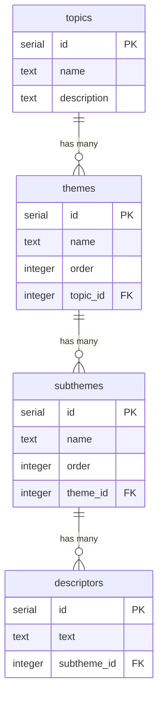

# Run server

npm run dev

# DB

DRIZZLE ORM

# Generate migration files

npx drizzle-kit generate:pg

# Run migrations

npm run db:migrate

# Or push schema directly (like prisma db push)

npm run db:push

# ERD

# ENDPOINTS DESIGN

GET /api/topics # List all topics
GET /api/topics/[id] # Get single topic
POST /api/topics # Create topic
PUT /api/topics/[id] # Update topic -- stretch goal
DELETE /api/topics/[id] # Delete topic

GET /api/themes # List all themes
GET /api/themes/[id] # Get single theme
POST /api/themes # Create theme
PUT /api/themes/[id] # Update theme -- stretch goal
DELETE /api/themes/[id] # Delete theme

GET /api/topics/[id]/themes # Get themes for a topic (ordered)
GET /api/topics/[id]/all # Get topic with all nested data

GET /api/subthemes/[id]/descriptors # Get descriptors for a subtheme - extension
GET /api/subthemes/[id]/descriptors # Get descriptors for a subtheme - extension
GET /api/full # Full tree structure

Extension
GET /api/search?q=term # Search across all levels
GET /api/topics/[id]/search?q=term # Search within a topic

# TODO

- add error handling and edge cases to endpoint testing eg if no topic exists on id return better messaging to user
- add error handling for themes with no topic id
- add endpoint.json to track all endpoints, serve up on /api

# Intergration testing with

https://blog.arcjet.com/testing-next-js-app-router-api-routes/
https://www.npmjs.com/package/next-test-api-route-handler#install
